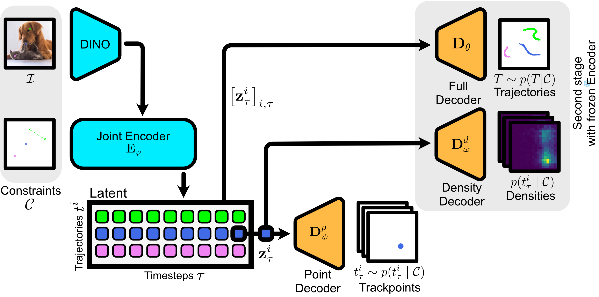
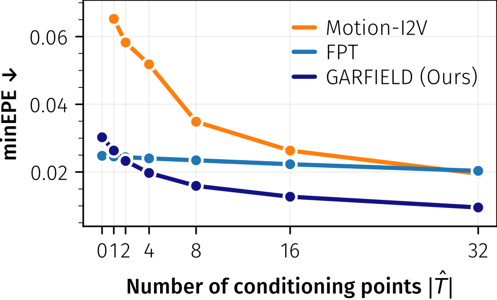
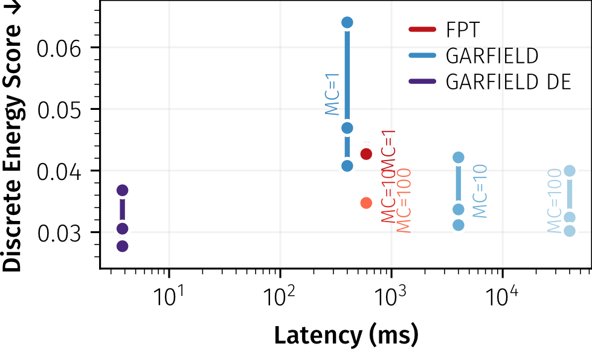
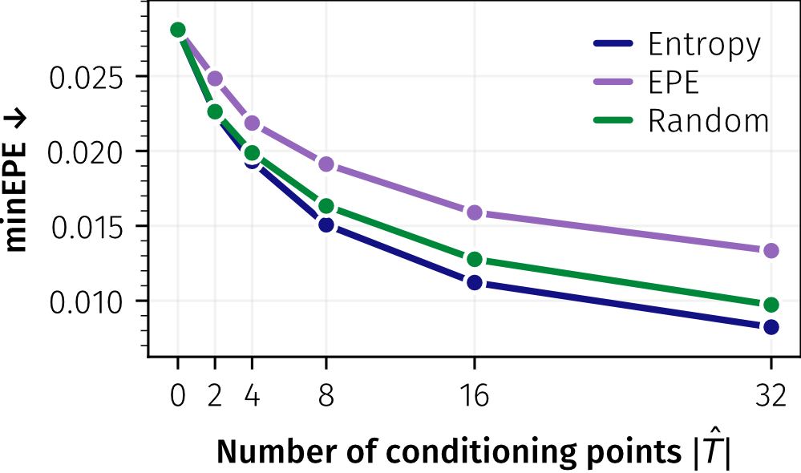

<p align="center">
 <h2 align="center">Schrödinger's Cat: Probabilistic Representation and Prediction of Potential Scene Kinematics</h2>
 <p align="center">
 <b>
 Timy Phan<sup>*</sup> · Jannik Wiese<sup>*</sup> · Björn Ommer
 </b>
 <p align="center"> 
    CompVis Group @ LMU Munich, Munich Center for Machine Learning (MCML)
 </p>
 <p align="center"> 
    ECCV 2026
 </p>
 <p align="center">
  <sup>*</sup>Equal contribution
 </p>
</p>
 </p>
<div align="center">

[](https://compvis.github.io/schroedingers_cat/)
[](!blank)
[](https://huggingface.co/CompVis/schroedingers_cat)

</div align="center">

Official Code for the paper "Schrödinger's Cat: Probabilistic Representation and Prediction of Potential Scene Kinematics" accepted at ECCV 2026.

## 💡 TL;DR

GARFIELD learns a structured latent representation of possible scene kinematics from an image and optional sparse spatio-temporal constraints. The representation supports both joint trajectory sampling and direct point-wise density estimation.

<p align="center">

</p>

## 📝 Overview

<p align="center">

</p>

Goal Aware Representations of Future kInEmatic Latent Distributions (GARFIELD) represents future scene kinematics as localized motion distributions. Given an initial image and optional sparse constraints, a joint encoder produces spatio-temporal latents for scene elements over time. These latents encode uncertainty about where each element may move, and separate decoders expose that uncertainty as point samples, coherent trajectory rollouts, or probability heatmaps.

The full pipeline consists of four components:

- **Encoder:** The joint encoder combines image features and sparse kinematic constraints into structured latents, each tied to one scene element and timestep.
- **Pointwise Decoder:** The pointwise decoder trains the latents to represent localized distributions by sampling individual future track positions from each latent component.
- **Full Decoder:** The full decoder samples complete trajectories jointly, preserving dependencies across points, timesteps, and scene elements for coherent motion realizations.
- **Density Decoder:** The density decoder deterministically maps localized latents to probability heatmaps, enabling fast uncertainty inspection without Monte-Carlo sampling.

## 📊 Results

### Motion Planning

<p align="center">

</p>

GARFIELD infers accurate motion from very sparse information and, with only four conditioning points, outperforms Motion-I2V using sixteen.

### Direct Density Decoding

<p align="center">

</p>

The density decoder achieves superior discrete energy scores while estimating motion densities orders of magnitude faster than Monte-Carlo sampling.


### Entropy-informed Conditioning

<p align="center">

</p>

Selecting additional constraints by entropy collapses uncertainty without ground-truth errors and reaches comparable performance with fewer conditioning points.

## 🛠️ Usage

### Weights and Inference Setup

For inference you can clone this repository by running:

```bash
git clone https://github.com/CompVis/schroedingers_cat
cd schroedingers_cat
```

Then, download pretrained model weights from 🤗 huggingface running:

```bash
hf download CompVis/schroedingers_cat --include "*.pt" --local-dir ckpts
```

Finally, create an environment to run the repository:

Conda (recommended):

```bash
conda create -n garfield python=3.12 -y
conda activate garfield
python -m pip install --upgrade pip
pip install -r requirements.txt
```

Virtual environment:

```bash
python3.12 -m venv .venv
source .venv/bin/activate
python -m pip install --upgrade pip
pip install -r requirements.txt
```

### Data preprocessing

`scripts/training/annotate_tapnext.py` runs [TapNext](https://github.com/google-deepmind/tapnet) over video WebDataset shards and writes tracked trajectories, visibility, and certainty annotations. Use `scripts/training/visualize_tapnext_shard.py` to inspect an annotated shard.

```bash
python -m scripts.training.annotate_tapnext \
  --input_dir <video-shards> --output_dir <annotated-shards> --sync_dir <locks>
```

### Training

`scripts/training/train.py` trains the `point`, `full`, or `density` stage from annotated shards and supports single- and multi-GPU training. The `full` and `density` stages use a frozen pretrained encoder supplied with `--encoder`.

```bash
python -m scripts.training.train \
  --stage point --tarbase <annotated-shards> --nr-steps <steps> --out-dir <runs>
```

### Quantitative inference

`scripts/inference/eval_sampling.py` evaluates a point or full trajectory decoder with best-of-*k* EPE, FDE, and PCK at thresholds 0.1 and 0.01. It takes annotated evaluation shards and reports both accuracy and runtime.

```bash
python -m scripts.inference.eval_sampling \
  --encoder <encoder.pt> --full <decoder.pt> --tarbase <eval-shards> --num-samples <n>
```

`scripts/inference/eval_density.py` evaluates the density decoder using the exact discrete energy score and reports encoder, decoder, and total runtime. Inputs are the same image-and-coordinate samples from annotated evaluation shards.

```bash
python -m scripts.inference.eval_density \
  --encoder <encoder.pt> --density <density.pt> --tarbase <eval-shards> --num-samples <n>
```

### Qualitative inference

`scripts/inference/qualitative_sampling.py` samples trajectories conditioned on one image and sparse coordinates from a CSV with columns `track_id,timestep,x,y`. It writes the sampled coordinates and an overlay visualization.

```bash
python -m scripts.inference.qualitative_sampling \
  --encoder <encoder.pt> --full <decoder.pt> --image <image.png> --goals <goals.csv> --output <dir>
```

For example try:

```bash
python -m scripts.inference.qualitative_sampling \
  --encoder ckpt/encoder.pt --full ckpt/full.pt --image examples/falling_ball.jpg --goals examples/falling_ball_goals.csv --output examples/
```

`scripts/inference/qualitative_density.py` takes the same image and coordinate constraints and renders the predicted point-wise densities as videos. Use `--gamma` to adjust density visualization contrast.

```bash
python -m scripts.inference.qualitative_density \
  --encoder <encoder.pt> --density <density.pt> --image <image.png> --goals <goals.csv> --output <dir>
```

For example try:

```bash
python -m scripts.inference.qualitative_density \
  --encoder ckpt/encoder.pt --density ckpt/dense.pt --image examples/tigerhunt.png --goals tigerhunt_goals.csv --output examples/
```

## Code conventions

Tensor shapes, dtypes, and value ranges are documented with `typing.Annotated`, for example `Annotated[torch.Tensor, "B T N 2, float, [0, 1]"]`.

Public model coordinates use `(x, y)` order and are normalized to `[0, 1]` relative to image width and height. The origin is the top-left corner, with `x` increasing rightward and `y` downward. TapNext shards store native `(y, x)` coordinates in `[-1, 1]`; the data loader converts them to the public convention. Images are normalized to `[-1, 1]`.

## License

The released model weights are licensed under [CC BY-NC 4.0](https://creativecommons.org/licenses/by-nc/4.0/deed.en).

## Code credit

- [crowsonkb/k-diffusion](https://github.com/crowsonkb/k-diffusion)
- [cloneofsimo/minDinoV2](https://github.com/cloneofsimo/minDinoV2)
- [CompVis/flow-poke-transformer](https://github.com/CompVis/flow-poke-transformer)
- [eliahuhorwitz/Academic-project-page-template](https://github.com/eliahuhorwitz/Academic-project-page-template)
- [google/nerfies](https://github.com/google/nerfies)

## Citation

```bibtex
@inproceedings{phan2026schrodingerscat,
  title     = {Schrödinger's Cat: Probabilistic Representation and Prediction of Potential Scene Kinematics},
  author    = {Phan, Timy and Wiese, Jannik and Ommer, Björn},
  booktitle = {European Conference on Computer Vision (ECCV)},
  year      = {2026}
}
```
